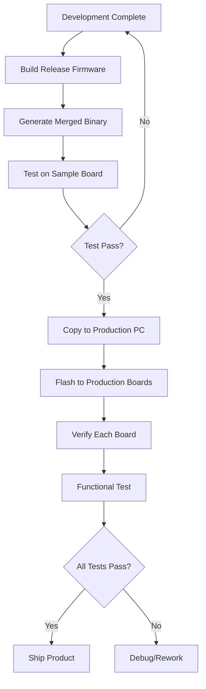

# Production Firmware Deployment Guide
## ESP32-S3 NCLite Connector

---

## Overview

This guide explains how to generate production firmware binaries and flash them to ESP32-S3 boards in a manufacturing/production environment, without requiring VSCode or the full development environment.

---

## Table of Contents

1. [Understanding ESP32 Firmware Files](#understanding-esp32-firmware-files)
2. [Generating Production Binaries](#generating-production-binaries)
3. [Flashing Methods](#flashing-methods)
4. [Factory Programming Setup](#factory-programming-setup)
5. [Troubleshooting](#troubleshooting)

---

## Understanding ESP32 Firmware Files

### ESP32-S3 uses BIN files (not HEX)

> [!IMPORTANT]
> ESP32 uses **binary (.bin)** files, not Intel HEX (.hex) files like some other microcontrollers.

After building your project, you'll find these files in the `build/` directory:

| File | Purpose | Required |
|------|---------|----------|
| `bootloader.bin` | First-stage bootloader | ✅ Yes |
| `partition-table.bin` | Partition layout | ✅ Yes |
| `nitara.connector.esp32s3.bin` | Your application firmware | ✅ Yes |
| `ota_data_initial.bin` | OTA data (if using OTA) | ⚠️ Optional |

### Flash Memory Layout

```
┌─────────────────────────────────────┐
│ 0x0000   Bootloader (32 KB)         │ ← bootloader.bin
├─────────────────────────────────────┤
│ 0x8000   Partition Table (4 KB)     │ ← partition-table.bin
├─────────────────────────────────────┤
│ 0x10000  Application (Main App)     │ ← nitara.connector.esp32s3.bin
│          (size varies)               │
├─────────────────────────────────────┤
│ 0xXXXXX  NVS (Non-Volatile Storage) │ (auto-initialized)
└─────────────────────────────────────┘
```

---

## Generating Production Binaries

### Method 1: Using VSCode (Development)

This is what you're currently doing:

```bash
# Build the project
idf.py build

# Flash to connected board
idf.py flash
```

### Method 2: Command Line Build (Production)

For production, you can build without VSCode:

```bash
# Navigate to project directory
cd d:\ESP32_CLV4\nitara.connector.esp32s3

# Build the project
idf.py build
```

**Output location:** `build/` directory

### Method 3: Generate Merged Binary (Single File)

For easier production flashing, create a **single merged binary**:

```bash
# Generate a single binary file with all components
esptool.py --chip esp32s3 merge_bin -o build/firmware_merged.bin ^
  --flash_mode dio ^
  --flash_freq 80m ^
  --flash_size 8MB ^
  0x0 build/bootloader/bootloader.bin ^
  0x8000 build/partition_table/partition-table.bin ^
  0x10000 build/nitara.connector.esp32s3.bin
```

> [!TIP]
> The merged binary contains everything at the correct offsets. You can flash it with a single command at address `0x0`.

---

## Flashing Methods

### Option 1: Using esptool.py (Recommended for Production)

**Install esptool** (one-time setup):
```bash
pip install esptool
```

#### Flash Individual Files:

```bash
esptool.py --chip esp32s3 --port COM3 --baud 921600 ^
  --before default_reset --after hard_reset write_flash ^
  -z --flash_mode dio --flash_freq 80m --flash_size 8MB ^
  0x0 build/bootloader/bootloader.bin ^
  0x8000 build/partition_table/partition-table.bin ^
  0x10000 build/nitara.connector.esp32s3.bin
```

**Replace `COM3` with your actual port** (check Device Manager)

#### Flash Merged Binary:

```bash
esptool.py --chip esp32s3 --port COM3 --baud 921600 ^
  --before default_reset --after hard_reset write_flash ^
  -z --flash_mode dio --flash_freq 80m --flash_size 8MB ^
  0x0 build/firmware_merged.bin
```

### Option 2: Using idf.py (Requires ESP-IDF)

```bash
idf.py -p COM3 flash
```

### Option 3: Using Flash Download Tool (GUI - Windows)

**Download:** [ESP Flash Download Tool](https://www.espressif.com/en/support/download/other-tools)

**Steps:**
1. Launch `flash_download_tool_x.x.x.exe`
2. Select **ESP32-S3**
3. Add files with addresses:
   - `bootloader.bin` → `0x0`
   - `partition-table.bin` → `0x8000`
   - `nitara.connector.esp32s3.bin` → `0x10000`
4. Configure:
   - **SPI Speed:** 80MHz
   - **SPI Mode:** DIO
   - **Flash Size:** 8MB
   - **COM Port:** Your port
   - **Baud:** 921600
5. Click **START**

> [!TIP]
> This GUI tool is excellent for factory workers who don't use command line.

---

## Factory Programming Setup

### Batch File for Production (Windows)

Create `flash_production.bat`:

```batch
@echo off
echo ========================================
echo  NCLite ESP32-S3 Production Flasher
echo ========================================
echo.

REM Check if port is provided
if "%1"=="" (
    echo Usage: flash_production.bat COM_PORT
    echo Example: flash_production.bat COM3
    exit /b 1
)

set PORT=%1
set BAUD=921600

echo Flashing to %PORT% at %BAUD% baud...
echo.

esptool.py --chip esp32s3 --port %PORT% --baud %BAUD% ^
  --before default_reset --after hard_reset write_flash ^
  -z --flash_mode dio --flash_freq 80m --flash_size 8MB ^
  0x0 build/firmware_merged.bin

if %ERRORLEVEL% EQU 0 (
    echo.
    echo ========================================
    echo  FLASHING SUCCESSFUL!
    echo ========================================
) else (
    echo.
    echo ========================================
    echo  FLASHING FAILED!
    echo ========================================
    exit /b 1
)

pause
```

**Usage:**
```bash
flash_production.bat COM3
```

### Verify Flashed Firmware

After flashing, verify the firmware:

```bash
# Read chip info
esptool.py --chip esp32s3 --port COM3 chip_id

# Verify flash
esptool.py --chip esp32s3 --port COM3 verify_flash ^
  0x0 build/firmware_merged.bin
```

---

## Production Workflow

### Recommended Production Process



### Step-by-Step Production Flashing

1. **Prepare Firmware Package:**
   ```
   production_firmware/
   ├── firmware_merged.bin
   ├── flash_production.bat
   └── README.txt (flashing instructions)
   ```

2. **Setup Production PC:**
   - Install Python 3.x
   - Install esptool: `pip install esptool`
   - Copy firmware package to production PC

3. **Flash Each Board:**
   ```bash
   # Connect ESP32-S3 via USB
   # Check COM port in Device Manager
   # Run batch file
   flash_production.bat COM3
   ```

4. **Verify Board:**
   - Check serial output (should see boot messages)
   - Verify BLE advertising (scan for "NCLite-ESP32")
   - Test basic functionality

---

## Advanced: OTA Updates

If you want to update firmware in the field without physical access:

### Enable OTA in menuconfig:
```bash
idf.py menuconfig
# Component config → ESP HTTPS OTA → Enable
```

### Flash OTA-capable firmware:
```bash
# Include OTA data partition
esptool.py --chip esp32s3 --port COM3 --baud 921600 ^
  write_flash ^
  0x0 build/bootloader/bootloader.bin ^
  0x8000 build/partition_table/partition-table.bin ^
  0xd000 build/ota_data_initial.bin ^
  0x10000 build/nitara.connector.esp32s3.bin
```

---

## Troubleshooting

### Issue: "Failed to connect to ESP32"

**Solutions:**
- Press and hold **BOOT** button while connecting
- Check USB cable (use data cable, not charge-only)
- Try lower baud rate: `--baud 115200`
- Install USB-to-Serial drivers (CP210x or CH340)

### Issue: "Flash size mismatch"

**Solution:**
- Check your board's actual flash size
- Update `--flash_size` parameter (4MB, 8MB, or 16MB)

### Issue: "Brown-out detector triggered"

**Solution:**
- Use external 5V power supply
- USB port may not provide enough current

### Issue: "Verification failed"

**Solution:**
- Re-flash with erase: add `--erase-all` before `write_flash`
- Check binary file integrity (re-build if needed)

---

## Quick Reference

### Common Commands

```bash
# Erase entire flash
esptool.py --chip esp32s3 --port COM3 erase_flash

# Read flash content
esptool.py --chip esp32s3 --port COM3 read_flash 0x0 0x400000 flash_backup.bin

# Get chip info
esptool.py --chip esp32s3 --port COM3 chip_id

# Monitor serial output
idf.py -p COM3 monitor
# Or use PuTTY/TeraTerm at 115200 baud
```

### Flash Addresses Reference

| Address | Content | Size |
|---------|---------|------|
| 0x0 | Bootloader | ~32 KB |
| 0x8000 | Partition Table | 4 KB |
| 0x10000 | Application | Variable |
| 0xXXX000 | NVS Storage | 24 KB |

---

## Summary

For **production deployment**:

1. ✅ Build firmware: `idf.py build`
2. ✅ Generate merged binary using `esptool.py merge_bin`
3. ✅ Flash using `esptool.py` or Flash Download Tool
4. ✅ Create batch scripts for factory workers
5. ✅ Verify each board after flashing

**No VSCode or ESP-IDF needed on production PC** - just Python + esptool!
